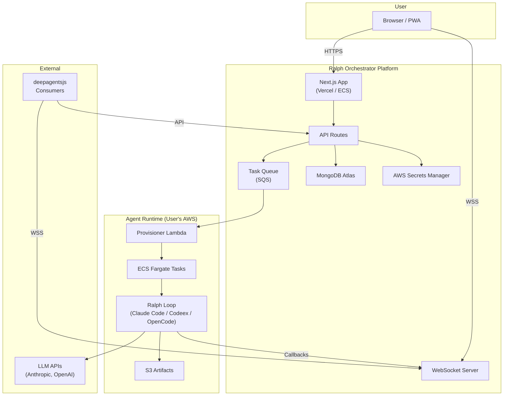
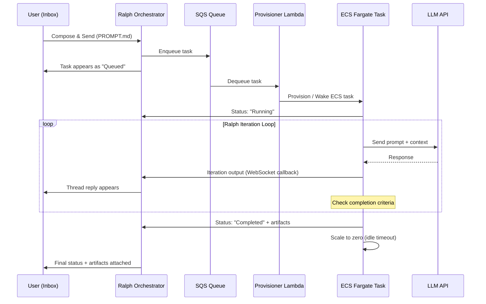
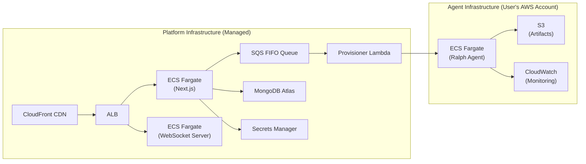
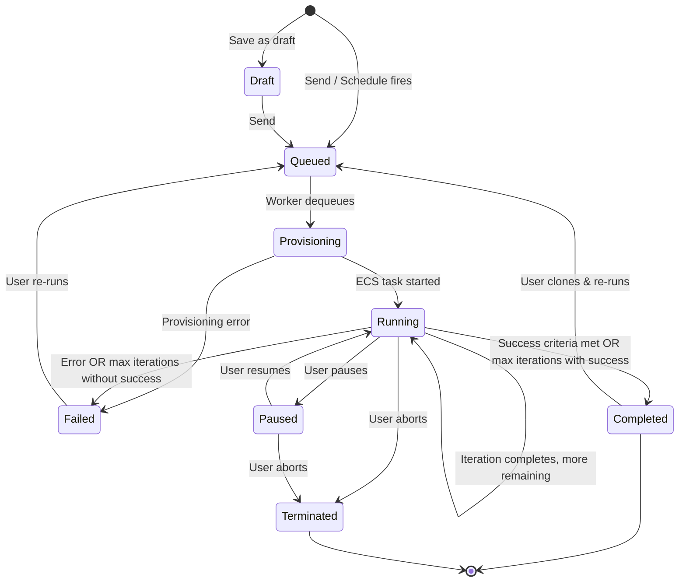

# Product Requirements Document: Ralph Orchestrator

## 1. Executive Summary

Ralph Orchestrator is a web-based platform that lets developers provision and interact with autonomous AI coding agents (Ralph loops) running on AWS infrastructure. The primary interface is a Gmail-style inbox where each "email" becomes a `PROMPT.md` that triggers a Ralph autonomous iteration loop. Users bring their own API keys (Anthropic, OpenAI, etc.) and AWS credentials. Agents auto-scale to zero when idle. The platform exposes agents as subagents compatible with deepagentsjs.

**Core metaphor**: The Agent Inbox IS the orchestration layer. Composing an email = defining a task. Sending = executing. Thread replies = iteration outputs.

---

## 2. Problem Statement

AI engineers and developers who want to run autonomous coding agents face three problems:

1. **Infrastructure burden**: Provisioning, scaling, and managing cloud resources for agent runtimes requires DevOps expertise unrelated to the actual task.
2. **No unified interface**: Monitoring multiple agent runs means juggling terminals, logs, and dashboards with no single pane of glass.
3. **No human-in-the-loop pathway**: Once an agent starts, injecting feedback or course-correcting requires killing and restarting the process.

Ralph Orchestrator eliminates these by wrapping Ralph loops in a familiar email-like interface backed by auto-scaling AWS infrastructure.

---

## 3. Goals & Success Metrics

| Goal | Metric | Target |
|------|--------|--------|
| Reduce agent provisioning time | Time from compose to first iteration output | < 60 seconds |
| Increase agent utilization | Percentage of paid compute time actively executing | > 85% |
| Enable HITL intervention | Percentage of running loops that accept injected feedback | 100% |
| Scale-to-zero efficiency | Idle cost when no agents running | $0 compute |
| Developer adoption | Monthly active users within 6 months of launch | 1,000 |
| PWA engagement | Percentage of returning users via installed PWA | > 30% |

---

## 4. User Personas

### 4.1 Solo AI Engineer — "Maya"
- Runs 5–10 Ralph loops per week for feature builds and bug fixes
- Wants fire-and-forget execution with notifications on completion
- Uses her own Anthropic API key; has basic AWS knowledge
- Values: speed, simplicity, cost transparency

### 4.2 Team Lead — "Jordan"
- Manages a team running 50+ loops per week across multiple repos
- Needs visibility into all running agents, resource usage, and costs
- Wants templates and guardrails for team members
- Values: oversight, consistency, cost control

### 4.3 Platform Integrator — "Alex"
- Building a higher-level agent system using deepagentsjs
- Needs Ralph loops as subagents callable via API
- Does not use the inbox UI; interacts exclusively through the API
- Values: reliability, protocol compliance, low latency

---

## 5. User Stories & Use Cases

### Authentication & Account
| ID | Story | Acceptance Criteria |
|----|-------|-------------------|
| US-01 | As a user, I can sign up and sign in so I can access my workspace | Sign up with email/password + GitHub OAuth; email verification; JWT session with HTTP-only cookie; redirects to workspace on success |
| US-02 | As a user, I can sign out so my session is closed | Sign out button in user menu; JWT invalidated; redirects to login page |
| US-03 | As a user, I can reset my password so I'm not blocked | "Forgot password" link on login; email with reset token; token expires in 1 hour; new password enforced |

### Projects
| ID | Story | Acceptance Criteria |
|----|-------|-------------------|
| US-04 | As a user, I can create a project so I can group settings, prompts, and runs | "New Project" button; name + optional description; project created in MongoDB; redirects to project workspace |
| US-05 | As a user, I can rename a project so it stays organized | Inline edit or settings modal for project name; updates immediately; reflected in sidebar |
| US-06 | As a user, I can delete a project so I can remove unused work | Delete with confirmation dialog; cascades to runs, drafts, IaC configs; irreversible warning shown |
| US-07 | As a user, I can switch between projects so I can manage multiple environments | Project switcher dropdown in sidebar/header; switching loads project-scoped data; last-used project remembered |

### Provider Keys (Claude Code / Codeex / OpenCode)
| ID | Story | Acceptance Criteria |
|----|-------|-------------------|
| US-08 | As a user, I can add a provider API key for Claude Code so Ralph agents can use it | Input field for API key; encrypted via AWS Secrets Manager on save; test-connection validates key; success/error feedback |
| US-09 | As a user, I can add a provider API key for Codeex so Ralph agents can use it | Same flow as US-08 for Codeex provider; provider-specific validation endpoint |
| US-10 | As a user, I can add a provider API key for OpenCode so Ralph agents can use it | Same flow as US-08 for OpenCode provider; provider-specific validation endpoint |
| US-11 | As a user, I can see which providers are configured without exposing plaintext keys | Provider list shows status badges (Configured ✓ / Not Configured); masked key display (e.g., `sk-...abc`); never full key |
| US-12 | As a user, I can rotate a provider key so I can replace compromised/expired keys | "Rotate" button per provider; enter new key; old key replaced in Secrets Manager; running agents unaffected until next loop |
| US-13 | As a user, I can delete a provider key so it can no longer be used | Delete with confirmation; key removed from Secrets Manager; provider status reverts to "Not Configured" |
| US-14 | As a user, I can be confident keys are encrypted at rest and never shown in full in the UI | AES-256 encryption via Secrets Manager; API never returns full key; audit log entry on access |

### AWS Configuration
| ID | Story | Acceptance Criteria |
|----|-------|-------------------|
| US-15 | As a user, I can configure AWS region so runs target the correct region | Region dropdown with all AWS regions; persists per project; default us-east-1 |
| US-16 | As a user, I can configure AWS authentication (assume-role or access keys) so the system can provision infrastructure | Choice of IAM Role ARN or Access Key pair; encrypted storage; least-privilege role template provided |
| US-17 | As a user, I can test AWS connectivity so I can verify credentials before running IaC | "Test Connection" button; calls STS GetCallerIdentity; shows success with account ID or error message |
| US-18 | As a user, I can update AWS credentials so I can rotate secrets safely | Edit credentials form; old credentials replaced; validation before save; running agents unaffected |

### IaC Templates & Drafts
| ID | Story | Acceptance Criteria |
|----|-------|-------------------|
| US-19 | As a user, I can choose an IaC template so I can start from a known baseline | Template selector with options (Fargate, Lambda, EC2 Spot); description + cost estimate per template |
| US-20 | As a user, I can generate IaC files from the selected template so I can provision infrastructure | "Generate" button produces Pulumi TypeScript; files stored per project; viewable immediately |
| US-21 | As a user, I can view the generated IaC files so I can understand what will be applied | Monaco editor in read-only mode; syntax highlighting; file tree if multiple files |
| US-22 | As a user (advanced), I can edit the IaC files in the UI before execution so I can customize the setup | Toggle to edit mode in Monaco editor; validation on save; invalid config shows inline errors |
| US-23 | As a user, I can save IaC drafts so I don't lose changes | Auto-save on edit; manual "Save Draft" button; draft indicator in UI; drafts persist across sessions |
| US-24 | As a user, I can see version history (draft vs applied) so I know what changed | Version list with timestamps and labels (draft/applied); inline diff view between versions; restore previous version |

### PROMPT.md (Email Template for Ralph Loops)
| ID | Story | Acceptance Criteria |
|----|-------|-------------------|
| US-25 | As a user, I can view the current PROMPT.md so I understand what will be sent to the Ralph agent | Read-only Markdown preview; frontmatter fields displayed as metadata; syntax highlighted |
| US-26 | As a user, I can edit PROMPT.md so I can control the Ralph loop instructions | Markdown editor with live preview; frontmatter editable via form fields; body editable as raw Markdown |
| US-27 | As a user, I can reset PROMPT.md to a default template so I can recover from mistakes | "Reset to Default" button with confirmation; restores template for selected category; preserves project-specific variables |
| US-28 | As a user, I can select which provider (Claude Code / Codeex / OpenCode) a run should use | Provider dropdown in compose/run dialog; only configured providers selectable; shows warning if none configured |

### Runs (Plan / Apply / Destroy)
| ID | Story | Acceptance Criteria |
|----|-------|-------------------|
| US-29 | As a user, I can start a Plan run so I can preview changes before applying | "Plan" button; queues run with type=plan; shows Pulumi preview output; no infrastructure modified |
| US-30 | As a user, I can start an Apply run so infrastructure changes are executed | "Apply" button with confirmation; queues run with type=apply; Pulumi up executed; resources provisioned |
| US-31 | As a user, I can start a Destroy run so I can tear down resources | "Destroy" button with double confirmation; queues run with type=destroy; all project resources removed |
| US-32 | As a user, I can see the run status (queued/running/succeeded/failed/canceled) so I know progress | Status badges in run list; real-time updates via WebSocket; status history timeline in detail view |
| US-33 | As a user, I can see run logs so I can debug failures | Log viewer with streaming output; timestamped entries; error highlighting; downloadable as text |
| US-34 | As a user, I can cancel a running job so I can stop unintended changes | "Cancel" button on running jobs; sends abort signal; status transitions to canceled; partial changes noted |
| US-35 | As a user, I can re-run a previous run (with the same draft) so I can retry after fixing issues | "Re-run" button on completed/failed runs; clones config into new run; editable before starting |

### Email-Driven Workflow (Ralph Loop)
| ID | Story | Acceptance Criteria |
|----|-------|-------------------|
| US-36 | As a user, when I start a run, the system sends an email (from PROMPT.md) to kick off the Ralph loop | Run start triggers email generation from PROMPT.md; email sent to agent endpoint; confirmation shown with thread ID |
| US-37 | As a user, I can see the email thread associated with a run (subject/thread ID and timestamps) | Thread metadata displayed in run detail; subject, thread ID, timestamps for each message; linkable |
| US-38 | As a user, inbound emails from the Ralph loop are captured and displayed as run logs | Inbound webhook captures Ralph responses; parsed and appended to run log; real-time display via WebSocket |
| US-39 | As a user, failures reported by email are reflected in run status so I can act quickly | Error emails parsed; run status auto-transitions to failed; failure reason extracted and displayed |

### Agents (Ephemeral Sessions & Spin-down)
| ID | Story | Acceptance Criteria |
|----|-------|-------------------|
| US-40 | As a user, I can see when an agent session is active for my project | Active agent indicator in project header; shows uptime, current iteration, resource usage |
| US-41 | As a user, agent sessions automatically spin down after an idle timeout | CloudWatch idle metric triggers scale-to-zero; configurable timeout; status transitions to "scaled down" |
| US-42 | As a user, I can manually stop an agent session so I can immediately halt activity | "Stop Agent" button; sends terminate signal; ECS task stopped; status transitions to terminated |
| US-43 | As a user, I can configure the idle timeout in project settings | Slider in project settings (5–60 minutes); default 15 min; persists per project |

### Audit & Safety
| ID | Story | Acceptance Criteria |
|----|-------|-------------------|
| US-44 | As a user, I can see an audit log of key changes and runs so I can review sensitive actions | Audit log page; filterable by action type (key change, run, config update); timestamps, user, action, target |
| US-45 | As a user, secrets are redacted from logs so I don't accidentally expose credentials | Log processing pipeline redacts patterns matching API keys, passwords, tokens; redacted text shows `[REDACTED]` |

### (Optional / Later) Minimal Subagent Messaging (deepagentsjs)
| ID | Story | Acceptance Criteria |
|----|-------|-------------------|
| US-46 | As a user, I can send a minimal message to an agent session | POST /api/v1/agents/:id/messages delivers message; 200 response with acknowledgment; message appears in thread |
| US-47 | As a user, I can receive streamed or incremental responses | WebSocket stream at /api/v1/agents/:id/stream; chunked iteration output; reconnection with replay |
| US-48 | As a developer, I can add a new subagent provider to the registry so the system is extensible | Provider registry config file; add provider with name, endpoint, auth scheme; platform discovers new providers on restart |

---

## 6. Functional Requirements

### 6.1 Authentication & User Management

- **Providers**: Email/password + GitHub OAuth via NextAuth.js
- **Session**: JWT stored in HTTP-only cookie; 7-day expiry with refresh
- **Roles**: `owner` (account creator), `member` (invited); future: team support
- **Onboarding flow**: Sign up → Verify email → Add LLM API key → (Optional) Add AWS credentials → Inbox

### 6.2 API Key & AWS Credential Management

- **Storage**: AWS Secrets Manager; each user gets a namespaced secret path (`/ralph/{userId}/keys`)
- **Encryption**: AES-256 at rest (Secrets Manager default); TLS in transit
- **Supported providers**: Anthropic (Claude), OpenAI, custom OpenAI-compatible endpoints
- **AWS credentials**: IAM access key pair or IAM role ARN for cross-account assume-role
- **Validation**: On save, platform makes a lightweight API call (e.g., list models) to verify key validity
- **Rotation**: Users can update keys at any time; running agents continue with cached key until loop completes

### 6.3 Agent Inbox (Primary Orchestration Interface)

- Three-column layout: Sidebar (folders) | List (tasks) | Detail (thread)
- Folders: All, Running, Completed, Failed, Queued, Starred, Archive, Drafts, Scheduled
- List items display: checkbox, star, subject, status badge, provider icon, timestamp, preview snippet
- Detail view: chronological thread of PROMPT.md (first message) + iteration outputs (replies)
- Real-time: WebSocket connection pushes new iteration outputs and status changes
- Unread indicators: Bold text + dot for tasks with new outputs since last viewed
- Mobile: Single-column with swipe gestures (swipe right = archive, swipe left = delete)

### 6.4 PROMPT.md Composer & Templates

- Full-screen modal or slide-over panel
- Fields: To (provider select), Subject (text input), Body (Markdown editor), Settings (accordion), Attachments (drop zone)
- Templates stored per-user in MongoDB; shareable via link (future: team templates)
- Variable interpolation at send time; unresolved variables block sending with error

### 6.5 Chat Interface (Real-time Monitoring)

- Accessible from inbox detail view via "Open in Chat" button or `t` shortcut
- Split-pane: left = file tree, right = streaming output
- Resizable panels via drag handle
- Code blocks rendered with shiki syntax highlighting; copy button on hover
- Action bar: Pause | Resume | Abort | Inject Feedback

### 6.6 IaC Editor

- Monaco editor embedded for Pulumi TypeScript editing
- Default template generated based on user's agent config (provider, instance type, timeout)
- Validation via Pulumi preview (dry run) before deployment
- Version history stored in MongoDB; diffs rendered inline

### 6.7 Resource Management

- Cost estimation formula: `(estimated_iterations × avg_iteration_duration × compute_rate) + LLM_token_cost_estimate`
- Active agent monitoring via polling (30s interval) or WebSocket heartbeat
- Scale-to-zero: CloudWatch alarm on idle metric → Lambda trigger → ECS scale-down
- Concurrent limit enforced at API layer; excess tasks enter FIFO queue

### 6.8 Subagent API

- Base URL: `https://api.ralph-orchestrator.com/api/v1`
- Auth: Bearer token (API key generated in settings)
- Rate limiting: 100 requests/minute per API key
- All responses follow JSON:API-like envelope: `{ data, meta, errors }`
- WebSocket: `wss://api.ralph-orchestrator.com/api/v1/agents/:id/stream`

---

## 7. Non-Functional Requirements

### 7.1 Performance

| Metric | Target |
|--------|--------|
| First Contentful Paint | < 1.5s |
| Time to Interactive | < 3s |
| Lighthouse PWA score | 100 |
| Inbox list render (1000 items) | < 200ms (virtual scrolling) |
| WebSocket message latency | < 500ms end-to-end |
| Agent provisioning (cold start) | < 60s |
| Agent provisioning (warm/wake) | < 10s |

### 7.2 Security

- All data encrypted in transit (TLS 1.3) and at rest (AES-256)
- API keys never logged, never returned after initial storage
- OWASP Top 10 compliance
- CSP headers, CORS restricted to app domain
- Rate limiting on all endpoints
- Audit log for credential access and agent operations

### 7.3 Scalability

- Support 10,000 concurrent users
- Support 1,000 concurrent agent executions per region
- Horizontal scaling via ECS service auto-scaling
- MongoDB Atlas auto-scaling for database tier
- CDN (CloudFront) for static assets

### 7.4 Reliability

- 99.9% uptime SLA for platform (not including user's AWS infra)
- Graceful degradation: if agent provisioning fails, task queued for retry (3 attempts, exponential backoff)
- WebSocket reconnection with message replay on disconnect
- Idempotent API operations where applicable

---

## 8. Technical Architecture

### 8.1 System Overview



### 8.2 Ralph Agent Architecture



**Ralph Loop Lifecycle:**
1. **Queued** — Task submitted, waiting for provisioning
2. **Provisioning** — AWS resources being allocated
3. **Running** — Ralph loop actively iterating
4. **Paused** — User paused execution; loop frozen
5. **Completed** — All success criteria met or max iterations reached with success
6. **Failed** — Error occurred or max iterations reached without success
7. **Scaling Down** — Agent idle, resources being released
8. **Terminated** — Agent stopped by user or system

### 8.3 Frontend Architecture

```
src/
├── app/                          # Next.js App Router
│   ├── (auth)/
│   │   ├── login/page.tsx
│   │   ├── signup/page.tsx
│   │   └── layout.tsx
│   ├── (dashboard)/
│   │   ├── inbox/
│   │   │   ├── page.tsx          # Inbox list view
│   │   │   └── [taskId]/page.tsx # Task detail/thread view
│   │   ├── chat/[taskId]/page.tsx
│   │   ├── settings/
│   │   │   ├── keys/page.tsx
│   │   │   ├── aws/page.tsx
│   │   │   ├── iac/page.tsx
│   │   │   └── templates/page.tsx
│   │   └── layout.tsx            # Inbox layout with sidebar
│   ├── api/
│   │   ├── auth/[...nextauth]/route.ts
│   │   ├── v1/
│   │   │   ├── agents/
│   │   │   │   ├── route.ts          # GET list, POST spawn
│   │   │   │   ├── [id]/route.ts     # GET status, DELETE terminate
│   │   │   │   ├── [id]/messages/route.ts
│   │   │   │   └── [id]/stream/route.ts  # WebSocket upgrade
│   │   │   ├── templates/route.ts
│   │   │   └── keys/route.ts
│   │   └── webhooks/
│   │       └── agent-callback/route.ts
│   ├── layout.tsx
│   ├── manifest.ts               # PWA manifest
│   └── sw.ts                     # Service worker (Serwist)
├── components/
│   ├── inbox/
│   │   ├── inbox-layout.tsx
│   │   ├── sidebar.tsx
│   │   ├── task-list.tsx
│   │   ├── task-list-item.tsx
│   │   ├── task-detail.tsx
│   │   ├── thread-message.tsx
│   │   ├── compose-modal.tsx
│   │   ├── bulk-actions-bar.tsx
│   │   └── search-command.tsx
│   ├── composer/
│   │   ├── prompt-editor.tsx
│   │   ├── template-selector.tsx
│   │   ├── variable-panel.tsx
│   │   ├── settings-accordion.tsx
│   │   └── attachment-zone.tsx
│   ├── chat/
│   │   ├── chat-layout.tsx
│   │   ├── message-stream.tsx
│   │   ├── file-tree.tsx
│   │   ├── code-block.tsx
│   │   └── action-bar.tsx
│   ├── iac/
│   │   ├── iac-editor.tsx
│   │   └── version-history.tsx
│   └── ui/                       # shadcn/ui components
├── lib/
│   ├── api.ts                    # API client
│   ├── ws.ts                     # WebSocket client
│   ├── auth.ts                   # NextAuth config
│   ├── db.ts                     # MongoDB client
│   ├── secrets.ts                # Secrets Manager client
│   ├── prompt.ts                 # PROMPT.md generation & interpolation
│   ├── hooks/
│   │   ├── use-keyboard-shortcuts.ts
│   │   ├── use-inbox.ts
│   │   ├── use-agent-stream.ts
│   │   └── use-task-selection.ts
│   └── types/
│       ├── task.ts
│       ├── agent.ts
│       ├── template.ts
│       └── prompt.ts
├── workers/
│   └── sw.ts                     # Serwist service worker
└── styles/
    └── globals.css
```

**Key libraries:**
- `@tanstack/react-virtual` — virtual scrolling for task list
- `@uiw/react-md-editor` — Markdown editor with preview
- `shiki` — syntax highlighting in chat output
- `@monaco-editor/react` — IaC editor
- `serwist` — PWA service worker for Next.js App Router
- `socket.io-client` — WebSocket client

### 8.4 Backend Architecture

- **Runtime**: Next.js API routes (serverless on Vercel or ECS)
- **Database**: MongoDB Atlas (shared cluster for dev, dedicated M10+ for prod)
- **Queue**: AWS SQS FIFO queue for task ordering
- **WebSocket**: Separate WebSocket server (Socket.IO on ECS) or Next.js API route with upgrade
- **Agent callbacks**: HTTPS webhook from agent runtime to platform

**Server Actions** (Next.js) for:
- `createTask(formData)` — validates, stores, enqueues
- `archiveTasks(taskIds)` — bulk archive
- `updateLabel(taskId, labels)` — label management
- `saveTemplate(templateData)` — template CRUD
- `injectFeedback(taskId, message)` — HITL message delivery

### 8.5 Infrastructure Architecture



**Cross-account deployment**: Platform assumes an IAM role in the user's AWS account to provision ECS tasks. Users create this role during onboarding via a CloudFormation one-click template.

### 8.6 Data Model

```typescript
// MongoDB Collections

interface User {
  _id: ObjectId;
  email: string;
  name: string;
  passwordHash?: string;        // null if OAuth
  oauthProvider?: "github";
  oauthId?: string;
  secretsPath: string;          // AWS Secrets Manager path
  defaultProvider: "claude-code" | "codeex" | "opencode";
  awsRoleArn?: string;
  settings: {
    idleTimeoutMinutes: number; // default: 15
    maxConcurrentAgents: number; // default: 5
    notificationPreferences: {
      onComplete: boolean;
      onFail: boolean;
      onOutput: boolean;
    };
  };
  createdAt: Date;
  updatedAt: Date;
}

interface Task {
  _id: ObjectId;
  userId: ObjectId;
  subject: string;
  status: "draft" | "queued" | "provisioning" | "running" | "paused" | "completed" | "failed" | "terminated";
  provider: "claude-code" | "codeex" | "opencode";
  promptMd: string;             // Generated PROMPT.md content
  variables: Record<string, string>;
  config: {
    maxIterations: number;
    timeoutPerIteration: number; // seconds
    successCriteria: string;
    repoUrl?: string;
    branch?: string;
  };
  attachments: Array<{
    filename: string;
    s3Key: string;
    mimeType: string;
    sizeBytes: number;
  }>;
  folder: "inbox" | "archive" | "trash";
  labels: string[];
  starred: boolean;
  read: boolean;
  scheduledAt?: Date;
  agentId?: string;             // ECS task ARN
  iterations: Array<{
    number: number;
    startedAt: Date;
    completedAt?: Date;
    output: string;             // Markdown output from iteration
    status: "running" | "completed" | "failed";
    tokensUsed?: number;
  }>;
  artifacts: Array<{
    filename: string;
    s3Key: string;
    mimeType: string;
    sizeBytes: number;
  }>;
  costEstimate?: {
    computeCents: number;
    llmTokenCents: number;
    totalCents: number;
  };
  costActual?: {
    computeCents: number;
    llmTokenCents: number;
    totalCents: number;
  };
  startedAt?: Date;
  completedAt?: Date;
  createdAt: Date;
  updatedAt: Date;
}

interface Template {
  _id: ObjectId;
  userId: ObjectId;
  name: string;
  description: string;
  category: "code-review" | "feature-build" | "bug-fix" | "refactoring" | "custom";
  provider: "claude-code" | "codeex" | "opencode" | "any";
  promptMd: string;
  variables: string[];          // List of variable names used
  config: {
    maxIterations: number;
    timeoutPerIteration: number;
    successCriteria: string;
  };
  usageCount: number;
  createdAt: Date;
  updatedAt: Date;
}

interface Label {
  _id: ObjectId;
  userId: ObjectId;
  name: string;
  color: string;                // hex color
  createdAt: Date;
}

interface ApiKey {
  _id: ObjectId;
  userId: ObjectId;
  name: string;
  keyHash: string;              // bcrypt hash for lookup
  keyPrefix: string;            // first 8 chars for display: "ralph_ab..."
  lastUsedAt?: Date;
  createdAt: Date;
}

interface IacConfig {
  _id: ObjectId;
  userId: ObjectId;
  version: number;
  code: string;                 // Pulumi TypeScript source
  parameters: Record<string, unknown>;
  validatedAt?: Date;
  createdAt: Date;
}

// MongoDB Indexes
// Task: { userId: 1, status: 1 }, { userId: 1, folder: 1, createdAt: -1 }, { userId: 1, labels: 1 }
// Template: { userId: 1, category: 1 }
// ApiKey: { keyHash: 1 }
```

---

## 9. PROMPT.md Specification

### 9.1 Schema

```markdown
---
title: "{{subject}}"
agent: "{{provider}}"
max_iterations: {{max_iterations}}
timeout_per_iteration: {{timeout_seconds}}
repo: "{{repo_url}}"
branch: "{{branch}}"
success_criteria: "{{success_criteria}}"
created_at: "{{iso_timestamp}}"
task_id: "{{task_id}}"
callback_url: "{{callback_url}}"
---

# {{subject}}

## Task Description

{{body}}

## Context Files

{{#attachments}}
- `{{filename}}` — attached
{{/attachments}}

## Success Criteria

{{success_criteria}}

## Constraints

- Maximum iterations: {{max_iterations}}
- Timeout per iteration: {{timeout_seconds}}s
- Report progress after each iteration via callback URL
```

**Frontmatter fields:**

| Field | Type | Required | Description |
|-------|------|----------|-------------|
| `title` | string | yes | Task title (from subject line) |
| `agent` | enum | yes | `claude-code`, `codeex`, `opencode` |
| `max_iterations` | integer | yes | 1–100, default 10 |
| `timeout_per_iteration` | integer | yes | Seconds, default 300 |
| `repo` | string | no | Git repository URL to clone |
| `branch` | string | no | Branch to checkout/create |
| `success_criteria` | string | yes | Human-readable completion criteria |
| `created_at` | ISO 8601 | yes | Auto-generated |
| `task_id` | string | yes | Auto-generated UUID |
| `callback_url` | string | yes | Auto-generated webhook URL for status updates |

### 9.2 Variable Interpolation

Variables use Mustache-style double curly braces: `{{variable_name}}`

**Resolution order:**
1. User-defined variables from the variable panel
2. System variables (auto-populated):
   - `{{task_id}}` — UUID
   - `{{callback_url}}` — platform webhook endpoint
   - `{{iso_timestamp}}` — current time
   - `{{user_email}}` — authenticated user's email
3. Unresolved variables → block send with error listing missing variables

**Supported syntax:**
- `{{var}}` — simple substitution
- `{{#section}}...{{/section}}` — conditional block (renders if variable is truthy or non-empty array)
- `{{^section}}...{{/section}}` — inverted block (renders if variable is falsy or empty)

### 9.3 Template Library

Built-in templates shipped with the platform:

1. **Code Review** — Reviews a PR or branch diff
2. **Feature Implementation** — Builds a feature from specification
3. **Bug Fix** — Diagnoses and fixes a reported bug
4. **Refactoring** — Restructures code without changing behavior
5. **Test Writing** — Adds test coverage for specified modules
6. **Documentation** — Generates or updates docs

See Appendix 19.1 for full template content.

---

## 10. API Specifications

### Base URL
`https://api.ralph-orchestrator.com/api/v1`

### Authentication
All endpoints require `Authorization: Bearer <api_key>` header.

### Endpoints

#### Agents

**POST /agents/spawn**
```json
// Request
{
  "prompt_md": "string (raw PROMPT.md content)",
  "provider": "claude-code" | "codeex" | "opencode",
  "config": {
    "max_iterations": 10,
    "timeout_per_iteration": 300,
    "repo_url": "https://github.com/user/repo",
    "branch": "feature-branch",
    "success_criteria": "All tests pass"
  }
}
// Response 201
{
  "data": {
    "id": "agent_abc123",
    "status": "queued",
    "created_at": "2026-01-28T12:00:00Z"
  }
}
```

**GET /agents**
```json
// Query params: ?status=running&limit=20&offset=0
// Response 200
{
  "data": [
    {
      "id": "agent_abc123",
      "subject": "Add user auth",
      "status": "running",
      "provider": "claude-code",
      "iteration_count": 3,
      "created_at": "2026-01-28T12:00:00Z"
    }
  ],
  "meta": { "total": 42, "limit": 20, "offset": 0 }
}
```

**GET /agents/:id**
```json
// Response 200
{
  "data": {
    "id": "agent_abc123",
    "subject": "Add user auth",
    "status": "running",
    "provider": "claude-code",
    "prompt_md": "...",
    "iterations": [
      {
        "number": 1,
        "status": "completed",
        "output": "...",
        "started_at": "...",
        "completed_at": "..."
      }
    ],
    "artifacts": [],
    "cost": { "compute_cents": 12, "llm_token_cents": 45, "total_cents": 57 },
    "created_at": "...",
    "started_at": "...",
    "completed_at": null
  }
}
```

**POST /agents/:id/messages**
```json
// Request
{ "content": "Please also add input validation" }
// Response 200
{ "data": { "delivered": true, "message_id": "msg_xyz789" } }
```

**DELETE /agents/:id**
```json
// Response 200
{ "data": { "id": "agent_abc123", "status": "terminated" } }
```

#### WebSocket

**WSS /agents/:id/stream**

Connect with `Authorization` header or `?token=<api_key>` query param.

Messages (server → client):
```json
{ "type": "iteration_start", "data": { "number": 4, "started_at": "..." } }
{ "type": "iteration_output", "data": { "number": 4, "chunk": "Analyzing file..." } }
{ "type": "iteration_complete", "data": { "number": 4, "output": "...", "completed_at": "..." } }
{ "type": "status_change", "data": { "status": "completed" } }
{ "type": "artifact", "data": { "filename": "report.md", "url": "..." } }
{ "type": "error", "data": { "message": "..." } }
```

Messages (client → server):
```json
{ "type": "inject_feedback", "data": { "content": "..." } }
{ "type": "pause" }
{ "type": "resume" }
{ "type": "abort" }
```

#### Templates

**GET /templates**
**POST /templates**
**PUT /templates/:id**
**DELETE /templates/:id**

Standard CRUD with same auth. Request/response bodies mirror the Template data model.

---

## 11. Security Requirements

| Requirement | Implementation |
|-------------|---------------|
| API key storage | AWS Secrets Manager; AES-256 at rest; never returned after creation |
| User authentication | NextAuth.js with JWT; HTTP-only secure cookies |
| API authorization | Bearer token auth; rate limiting 100 req/min |
| Data encryption in transit | TLS 1.3 enforced on all endpoints |
| Data encryption at rest | MongoDB Atlas encryption; S3 SSE-S3 |
| CSRF protection | SameSite cookie + CSRF token on mutations |
| XSS prevention | React default escaping + CSP header |
| SQL/NoSQL injection | Mongoose ODM with schema validation; no raw queries |
| Cross-account AWS | Least-privilege IAM role; scoped to ECS, S3, CloudWatch only |
| Audit logging | All credential access, agent operations logged to CloudWatch Logs |
| Secret rotation | Users can rotate keys; platform rotates internal keys quarterly |
| Dependency scanning | Dependabot + Snyk in CI pipeline |

---

## 12. Infrastructure as Code Specifications

Users can view and edit the Pulumi TypeScript that provisions their agent runtime. Default template:

```typescript
// Default Pulumi template for Ralph agent provisioning
import * as pulumi from "@pulumi/pulumi";
import * as aws from "@pulumi/aws";

const config = new pulumi.Config();

// User-editable parameters
const instanceType = config.get("instanceType") || "FARGATE";
const cpu = config.getNumber("cpu") || 1024;        // 1 vCPU
const memory = config.getNumber("memory") || 2048;   // 2 GB
const idleTimeoutMinutes = config.getNumber("idleTimeout") || 15;
const maxConcurrent = config.getNumber("maxConcurrent") || 5;

// ECS Cluster
const cluster = new aws.ecs.Cluster("ralph-agents", {
  settings: [{ name: "containerInsights", value: "enabled" }],
});

// Task Definition
const taskDef = new aws.ecs.TaskDefinition("ralph-agent-task", {
  family: "ralph-agent",
  networkMode: "awsvpc",
  requiresCompatibilities: [instanceType],
  cpu: cpu.toString(),
  memory: memory.toString(),
  executionRoleArn: executionRole.arn,
  taskRoleArn: taskRole.arn,
  containerDefinitions: JSON.stringify([{
    name: "ralph-agent",
    image: "ghcr.io/ralph-orchestrator/agent:latest",
    essential: true,
    logConfiguration: {
      logDriver: "awslogs",
      options: {
        "awslogs-group": "/ecs/ralph-agent",
        "awslogs-region": aws.config.region,
        "awslogs-stream-prefix": "ralph",
      },
    },
    environment: [
      { name: "CALLBACK_URL", value: "{{callback_url}}" },
      { name: "TASK_ID", value: "{{task_id}}" },
    ],
    secrets: [
      { name: "LLM_API_KEY", valueFrom: "{{secrets_arn}}" },
    ],
  }]),
});

// Auto-scaling (scale-to-zero)
const scalingTarget = new aws.appautoscaling.Target("ralph-scaling", {
  maxCapacity: maxConcurrent,
  minCapacity: 0,
  resourceId: pulumi.interpolate`service/${cluster.name}/ralph-agents`,
  scalableDimension: "ecs:service:DesiredCount",
  serviceNamespace: "ecs",
});

const scaleDownPolicy = new aws.appautoscaling.Policy("ralph-scale-down", {
  policyType: "StepScaling",
  resourceId: scalingTarget.resourceId,
  scalableDimension: scalingTarget.scalableDimension,
  serviceNamespace: scalingTarget.serviceNamespace,
  stepScalingPolicyConfiguration: {
    adjustmentType: "ExactCapacity",
    stepAdjustments: [{ scalingAdjustment: 0, metricIntervalUpperBound: 0 }],
    cooldown: idleTimeoutMinutes * 60,
  },
});

export const clusterArn = cluster.arn;
export const taskDefinitionArn = taskDef.arn;
```

**Editable parameters exposed in UI:**

| Parameter | Type | Default | Description |
|-----------|------|---------|-------------|
| `cpu` | number | 1024 | CPU units (256, 512, 1024, 2048, 4096) |
| `memory` | number | 2048 | Memory MB (512–30720, depends on CPU) |
| `idleTimeout` | number | 15 | Minutes before scale-to-zero |
| `maxConcurrent` | number | 5 | Max simultaneous agents |

---

## 13. Integration with deepagentsjs

Ralph Orchestrator agents are compatible as deepagentsjs subagents via a standard protocol.

### Subagent Protocol

```typescript
// deepagentsjs SubAgent interface compliance
interface RalphSubAgent {
  // Spawn a new Ralph loop with the given PROMPT.md
  spawn(promptMd: string, config?: AgentConfig): Promise<AgentHandle>;

  // Send a message to a running agent (HITL feedback)
  sendMessage(agentId: string, message: string): Promise<void>;

  // Receive streaming output from agent
  receiveStream(agentId: string): AsyncIterable<AgentEvent>;

  // Terminate a running agent
  terminate(agentId: string): Promise<void>;
}

interface AgentHandle {
  id: string;
  status: AgentStatus;
  createdAt: string;
}

interface AgentConfig {
  provider?: "claude-code" | "codeex" | "opencode";
  maxIterations?: number;
  timeoutPerIteration?: number;
  repoUrl?: string;
  branch?: string;
  successCriteria?: string;
}

type AgentStatus = "queued" | "provisioning" | "running" | "paused" | "completed" | "failed" | "terminated";

type AgentEvent =
  | { type: "iteration_start"; number: number; startedAt: string }
  | { type: "iteration_output"; number: number; chunk: string }
  | { type: "iteration_complete"; number: number; output: string; completedAt: string }
  | { type: "status_change"; status: AgentStatus }
  | { type: "artifact"; filename: string; url: string }
  | { type: "error"; message: string };
```

### Usage from deepagentsjs

```typescript
import { RalphOrchestrator } from "@ralph-orchestrator/sdk";

const ralph = new RalphOrchestrator({
  apiKey: "ralph_abc123...",
  baseUrl: "https://api.ralph-orchestrator.com/api/v1",
});

// Spawn agent
const agent = await ralph.spawn(`
---
title: "Add login page"
agent: "claude-code"
max_iterations: 10
---
# Add Login Page
Build a login page with email/password fields...
`);

// Stream output
for await (const event of ralph.receiveStream(agent.id)) {
  if (event.type === "iteration_output") {
    console.log(event.chunk);
  }
}

// Inject feedback
await ralph.sendMessage(agent.id, "Also add a 'forgot password' link");

// Terminate
await ralph.terminate(agent.id);
```

---

## 14. UI/UX Requirements

### 14.1 Agent Inbox Design (Gmail-style)

**Layout**: Three-column responsive layout

| Column | Width | Components |
|--------|-------|------------|
| Sidebar | 240px fixed | Folders list, labels, compose button, user avatar |
| List | Flexible (min 360px) | Virtual-scrolled task list with checkboxes, stars, badges |
| Detail | Flexible (min 480px) | Thread view with iteration outputs |

**shadcn components used:**
- `Table` — task list rows
- `Checkbox` — bulk selection
- `DropdownMenu` — context menu on right-click, bulk actions
- `Command` — search palette (Cmd+K)
- `Badge` — status badges with color variants
- `Tabs` — folder navigation (mobile)
- `Separator` — visual dividers
- `Sheet` — compose modal (mobile)
- `Dialog` — compose modal (desktop), confirmations
- `ScrollArea` — thread view scrolling
- `Tooltip` — action button tooltips
- `Avatar` — user/agent avatars in thread

**Status badge variants:**
| Status | Color | Extra |
|--------|-------|-------|
| Running | Yellow/amber | Pulse animation |
| Completed | Green | Check icon |
| Failed | Red | X icon |
| Queued | Blue | Clock icon |
| Paused | Orange | Pause icon |
| Draft | Gray | Pencil icon |

### 14.2 PROMPT.md Composer Design

Full-screen dialog with sections:

1. **Header bar**: To (Select), Subject (Input), Send (Button), Save Draft, Save Template, Schedule
2. **Body**: Tabbed — Editor | Preview | Variables
3. **Settings**: Accordion — Iterations, Timeout, Success Criteria, Repository, Branch
4. **Attachments**: Drop zone at bottom

**shadcn components**: `Dialog`, `Input`, `Select`, `Button`, `Tabs`, `Accordion`, `Slider`, `Calendar` (for schedule), `DropdownMenu` (template selector)

### 14.3 Chat Interface Design

Split-pane layout:
- **Left pane** (30%): File tree (`ScrollArea` + custom tree component)
- **Right pane** (70%): Streaming output (`ScrollArea`, `Card` per message, `Avatar` for agent/user, `Skeleton` for loading)
- **Bottom bar**: Input (`Textarea`), action buttons (`Button` variants)

**shadcn components**: `ScrollArea`, `Card`, `Avatar`, `Button`, `Input`, `Textarea`, `Skeleton`, `Badge`, `Separator`

### 14.4 Component Library (shadcn)

All UI built on shadcn/ui with the following theme customizations:
- **Font**: `Inter` (sans) / `JetBrains Mono` (mono)
- **Border radius**: `0.5rem`
- **Colors**: Default shadcn palette with custom status colors

### 14.5 Responsive Design

| Breakpoint | Layout |
|-----------|--------|
| Desktop (≥1280px) | Three-column inbox |
| Tablet (768–1279px) | Two-column (sidebar collapses to hamburger) |
| Mobile (<768px) | Single-column with bottom navigation |

### 14.6 Keyboard Navigation

Full Gmail-style keyboard shortcuts (documented in Section 5, US-INBOX-08). Implementation uses a custom `useKeyboardShortcuts` hook that registers handlers on the document and respects focus context (disabled when typing in inputs).

### 14.7 PWA Experience

**Service Worker (Serwist)**:
```typescript
// sw.ts
import { defaultCache } from "@serwist/next/worker";
import { Serwist } from "serwist";

const serwist = new Serwist({
  precacheEntries: self.__SW_MANIFEST,
  skipWaiting: true,
  clientsClaim: true,
  runtimeCaching: defaultCache,
});

serwist.addEventListeners();
```

**Manifest** (`app/manifest.ts`):
```typescript
export default function manifest() {
  return {
    name: "Ralph Orchestrator",
    short_name: "Ralph",
    description: "Gmail for AI Agents",
    start_url: "/inbox",
    display: "standalone",
    background_color: "#09090b",
    theme_color: "#09090b",
    icons: [
      { src: "/icons/icon-192.png", sizes: "192x192", type: "image/png" },
      { src: "/icons/icon-512.png", sizes: "512x512", type: "image/png" },
    ],
  };
}
```

**Offline capabilities**:
- IndexedDB (via `idb` library) caches task list and thread content
- Compose offline → queued in IndexedDB → synced on reconnect via Background Sync API
- Offline indicator banner in header

**Push notifications**:
- Web Push API with VAPID keys
- User subscribes in settings; `PushSubscription` stored in MongoDB
- Platform sends notifications on: agent complete, agent failed, new iteration output (if enabled)

---

## 15. Testing Requirements

| Layer | Tool | Coverage Target |
|-------|------|----------------|
| Unit tests | Vitest | 80% line coverage on lib/ and components/ |
| Component tests | React Testing Library | All interactive components |
| E2E tests | Playwright | Critical flows: auth, compose, inbox navigation, chat |
| API tests | Vitest + supertest | All API endpoints |
| Load tests | k6 | 1000 concurrent WebSocket connections |
| Accessibility | axe-core + Playwright | WCAG 2.1 AA compliance |
| PWA validation | Lighthouse CI | Score ≥ 95 across all categories |

**CI pipeline runs on every PR**: lint → typecheck → unit tests → build → E2E tests → Lighthouse

---

## 16. Deployment & DevOps

| Component | Deployment Target | Strategy |
|-----------|------------------|----------|
| Next.js app | Vercel (primary) or ECS Fargate | Preview deployments per PR; production on main merge |
| WebSocket server | ECS Fargate | Blue/green deployment |
| Provisioner Lambda | AWS Lambda | SAM/CDK deploy |
| Agent container image | ECR | Built in CI; tagged with git SHA |
| Database | MongoDB Atlas | Managed; migrations via custom scripts |
| Secrets | AWS Secrets Manager | Terraform-managed |

**CI/CD**: GitHub Actions
- PR: lint + typecheck + test + build + preview deploy
- Main: full test suite + production deploy + smoke tests

**Monitoring**:
- Application: Sentry (errors), Vercel Analytics (Web Vitals)
- Infrastructure: CloudWatch dashboards + alarms
- Agent runtime: CloudWatch Logs + custom metrics

---

## 17. Timeline & Milestones

| Phase | Milestone | Deliverables |
|-------|-----------|-------------|
| 1 - Foundation | Auth + Inbox Shell | Auth flow, inbox layout, MongoDB schema, basic task CRUD |
| 2 - Core Loop | End-to-end Ralph Execution | Compose → SQS → Lambda → ECS agent → callback → thread display |
| 3 - Real-time | Live Updates | WebSocket integration, streaming output, status badges |
| 4 - HITL | Human-in-the-Loop | Reply to inject feedback, pause/resume/abort |
| 5 - Polish | Templates + Search + PWA | Template library, full-text search, PWA with push notifications |
| 6 - IaC + Subagent | Advanced Features | IaC editor, deepagentsjs SDK, cost monitoring |
| 7 - Scale | Production Hardening | Load testing, security audit, monitoring, documentation |

---

## 18. Risks & Mitigations

| Risk | Likelihood | Impact | Mitigation |
|------|-----------|--------|------------|
| Cold start latency >60s on ECS Fargate | Medium | High | Pre-warm pool of standby tasks; use Lambda for lightweight agents |
| User AWS credential misuse | Low | Critical | Least-privilege IAM role template; CloudTrail logging; credential scope validation |
| WebSocket scaling under load | Medium | Medium | Socket.IO with Redis adapter for horizontal scaling; fallback to SSE |
| LLM API rate limits blocking agents | Medium | Medium | Queue-based throttling; user-configurable concurrency limits |
| MongoDB query performance at scale | Low | Medium | Proper indexing (see Data Model); read replicas; caching hot queries |
| PWA service worker cache staleness | Low | Low | Version-based cache busting; stale-while-revalidate strategy |
| Cost overruns from runaway agents | Medium | High | Hard timeout per iteration; max iterations cap; budget alerts |
| Cross-account IAM complexity | High | Medium | One-click CloudFormation template; detailed onboarding guide; validation checks |

---

## 19. Appendix

### 19.1 PROMPT.md Examples

#### Code Review Template

```markdown
---
title: "Code Review: {{branch}}"
agent: "claude-code"
max_iterations: 3
timeout_per_iteration: 180
repo: "{{repo_url}}"
branch: "{{branch}}"
success_criteria: "Review complete with actionable feedback"
---

# Code Review: {{branch}}

## Task

Review the changes on branch `{{branch}}` compared to `main`. Focus on:

1. **Correctness** — Logic errors, edge cases, off-by-one errors
2. **Security** — Injection vulnerabilities, auth bypasses, data exposure
3. **Performance** — N+1 queries, unnecessary re-renders, memory leaks
4. **Maintainability** — Code clarity, naming, DRY violations

## Output Format

For each issue found, provide:
- File and line number
- Severity (critical / warning / suggestion)
- Description of the issue
- Suggested fix with code snippet

## Success Criteria

- All files in the diff reviewed
- No critical issues left unaddressed
- Summary table of findings at the end
```

#### Feature Implementation Template

```markdown
---
title: "Feature: {{feature_name}}"
agent: "claude-code"
max_iterations: 15
timeout_per_iteration: 300
repo: "{{repo_url}}"
branch: "feat/{{feature_slug}}"
success_criteria: "Feature implemented, tests pass, typecheck passes"
---

# Feature: {{feature_name}}

## Description

{{feature_description}}

## Requirements

{{#requirements}}
- {{.}}
{{/requirements}}

## Technical Approach

- Framework: {{framework}}
- Key files to modify: {{key_files}}

## Acceptance Criteria

1. All requirements implemented
2. Unit tests added for new logic
3. `npm run typecheck` passes
4. `npm run test` passes
5. No new lint warnings

## Constraints

- Follow existing code patterns in the repository
- Do not modify unrelated files
- Keep changes focused on the feature scope
```

#### Bug Fix Template

```markdown
---
title: "Fix: {{bug_title}}"
agent: "claude-code"
max_iterations: 10
timeout_per_iteration: 300
repo: "{{repo_url}}"
branch: "fix/{{bug_slug}}"
success_criteria: "Bug fixed, regression test added, all tests pass"
---

# Bug Fix: {{bug_title}}

## Bug Report

**Observed behavior**: {{observed}}

**Expected behavior**: {{expected}}

**Reproduction steps**:
{{repro_steps}}

## Task

1. Reproduce the bug (find the root cause)
2. Implement the fix
3. Add a regression test that would have caught this bug
4. Verify all existing tests still pass

## Success Criteria

- Root cause identified and documented in commit message
- Fix implemented with minimal changes
- Regression test added
- `npm run test` passes
- `npm run typecheck` passes
```

#### Refactoring Template

```markdown
---
title: "Refactor: {{refactor_target}}"
agent: "claude-code"
max_iterations: 10
timeout_per_iteration: 300
repo: "{{repo_url}}"
branch: "refactor/{{refactor_slug}}"
success_criteria: "Refactoring complete, all tests pass, no behavior changes"
---

# Refactor: {{refactor_target}}

## Goal

{{refactor_goal}}

## Scope

Files/modules to refactor:
{{#files}}
- `{{.}}`
{{/files}}

## Approach

{{refactor_approach}}

## Constraints

- **No behavior changes** — All existing tests must pass without modification
- **No new dependencies** — Use existing libraries only
- **Incremental** — Each iteration should leave the code in a working state

## Success Criteria

- All specified files refactored according to the goal
- All existing tests pass (no modifications to tests)
- `npm run typecheck` passes
- Code is cleaner/more maintainable (subjective — document reasoning)
```

### 19.2 Ralph Loop Lifecycle Diagrams

```mermaid
gantt
    title Ralph Loop Execution Timeline
    dateFormat  HH:mm
    axisFormat  %H:%M

    section Lifecycle
    Queued          :a1, 00:00, 1m
    Provisioning    :a2, after a1, 1m
    Iteration 1     :a3, after a2, 5m
    Iteration 2     :a4, after a3, 5m
    Iteration 3     :a5, after a4, 5m
    Completed       :milestone, after a5, 0m
    Idle timeout    :a6, after a5, 15m
    Scale to zero   :milestone, after a6, 0m
```




